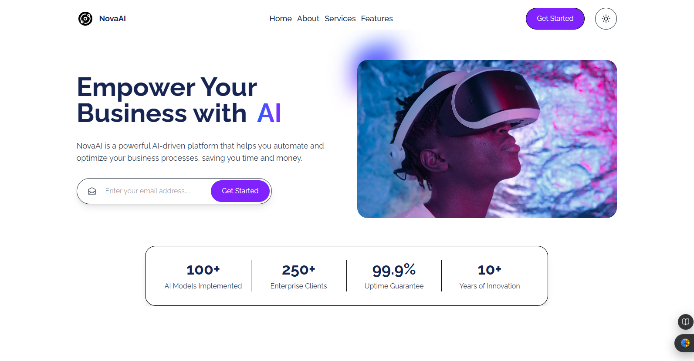
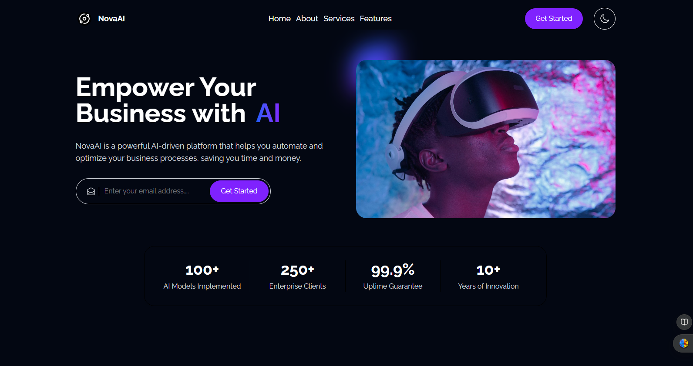

# Landing Page for AI 🚀

A modern, responsive landing page for AI products and services built with React and TypeScript.




## 🌟 Features

- **Fully Responsive Design**: Looks great on all devices from mobile to desktop
- **TypeScript Integration**: Type-safe code for better development experience
- **Modern React Patterns**: Built with functional components and hooks
- **Optimized Performance**: Fast loading and smooth animations
- **Dark mode ready (optional toggle)  

## 🛠️ Tech Stack

- React 18+
- TypeScript 5+
- Tailwind CSS for styling
- React Testing Library for tests
- Vite for build tooling


## 📁 Project Structure

```
landing-page/
├── public/             # Static files
├── src/
│   ├── assets/         # Images etc.
│   ├── components/     # Reusable components
│   │   ├── cards/     # Common UI components
│   │   ├── Elements/     # Layout components
│   │   ├── Shared/     # Layout components
│   │   └── sections/   # Page sections
│   ├── Store/          # Theme Store
│   ├── types/          # TypeScript type definitions
│   ├── utils/          # Utility functions
│   ├── App.tsx         # Main App component
│   ├── main.tsx        # Entry point
│   └── vite-env.d.ts   # Vite type declarations
├── .eslintrc.cjs       # ESLint configuration
├── .gitignore          # Git ignore file
├── index.html          # HTML template
├── package.json        # Dependencies and scripts
├── README.md           # Project documentation
├── tailwind.config.js  # Tailwind CSS configuration
├── tsconfig.json       # TypeScript configuration
└── vite.config.ts      # Vite configuration
```


### Styling

This project uses Tailwind CSS for styling. You can customize the theme in `tailwind.config.js`:

## 🙏 Acknowledgements

- [React](https://reactjs.org/)
- [TypeScript](https://www.typescriptlang.org/)
- [Tailwind CSS](https://tailwindcss.com/)
- [Vite](https://vitejs.dev/)
- [PedroTech](https://www.youtube.com/@PedroTechnologies)


## 📞 Contact

👤 **Kasam Ali Aftab**  
💼 **Software Engineer**  


---

Made with ❤️ by [VERIDIITE]
